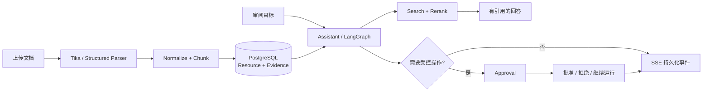

# DocReview Agent

> **Evidence-first document review**：让 Agent 的每个结论都能回到文档证据，让每个受控操作都经过可追踪的审批。

[](pyproject.toml)
[](frontend/README.md)
[](https://github.com/87hujih/redline-foundry/actions)
[](#许可证)

DocReview Agent 是一个面向合同、制度、研究材料和内部知识库的文档审阅工作台。它把文档解析、结构化 RAG、引用证据、持久化 Assistant 会话、LangGraph Agent、人工审批和可重复评测放进同一套 workspace-scoped 服务中。

它关注的不是“生成一段看起来合理的文字”，而是：**检索到什么、回答依据什么、Agent 做了什么、谁批准了什么，都可以被复盘。**

> 项目当前是可审计的服务骨架与评测基线，不是开箱即用的 SaaS。生产环境需要批准的 PostgreSQL 基础 schema、模型服务、Tika、受信身份入口、文件存储和监控。仓库不包含历史基础 migration，也不提供默认生产凭据。

## 为什么值得看

| 常见 Agent 痛点 | DocReview Agent 的处理方式 |
| --- | --- |
| 长文档检索只返回零散 chunk | 结构化分块 + parent/child 上下文窗口 + rerank + citation provenance |
| SSE 断线后结果丢失或重复执行 | 事件先持久化，`Last-Event-ID` replay；使用稳定 `X-Request-ID` 保证幂等 |
| Agent 工具调用不可控 | workspace scope、工具策略、Approval continuation 和完整 Run 轨迹 |
| “评测通过”依赖一次 LLM judge | 确定性检索/回答/Agent/安全门禁与可选 LLM 评审分层 |
| 多租户边界依赖前端自觉 | trusted-ingress HMAC attestation + 服务端 scope predicate |

## 从文档到可审计结论



一次典型审阅会经历：上传或选择 Resource → 指定审阅目标 → 检索证据 → 流式接收回答 → 查看引用与 Run steps → 对受控工具调用进行审批。前端工作台对应 Assistant、Resources、Runs 和 Approvals 四个主要视图。

## 能力地图

| 模块 | 已实现能力 | 入口 |
| --- | --- | --- |
| 文档库 | 上传、解析、版本、检索、引用、Markdown 导出、下载 | `/api/resources/*`、`/api/files/*` |
| Assistant | 会话、消息、SSE、断线 replay、幂等重试 | `/api/assistant/*` |
| Agent | Run、步骤、工具调用、Finding、状态筛选 | `/api/agent/runs/*` |
| Human-in-the-loop | Approval 列表、详情、批准、拒绝、continuation | `/api/agent/approvals/*` |
| 安全与运行时 | workspace scope、HMAC ingress、request ID、runtime/projection worker | `src/docreview/identity`、`src/docreview/runtime` |
| 评测 | 检索、回答、轨迹、工具、安全、延迟和成本指标 | [`evals/README.md`](evals/README.md) |

## 技术栈

`Python 3.13` · `FastAPI` · `LangGraph` · `PostgreSQL` · `Apache Tika` · `SiliconFlow/OpenAI-compatible providers` · `React` · `TypeScript` · `Vite` · `Playwright` · `uv`

## 快速开始

### 1. 准备环境

当前本地编排脚本面向 Windows：

- Python `>=3.13,<3.14`
- [uv](https://docs.astral.sh/uv/)
- Docker（脚本会运行 `apache/tika:3.3.0.0`）
- 已按当前契约初始化的 PostgreSQL

### 2. 安装并创建本地配置

```powershell
uv sync --locked --dev
Copy-Item .env.example .env
```

编辑 `.env` 中的 `DATABASE_URL`、LLM/Embedding/Reranker、`TIKA_URL`、tokenizer profile 和 trusted-ingress secret。不要提交 `.env` 或真实密钥；Web Search 是可选能力，未配置时不会注册工具。

### 3. 启动

```powershell
.\scripts\start-local.ps1
```

脚本会检查/启动本地 PostgreSQL、Tika，执行幂等身份初始化，然后启动 API。仅查看状态：

```powershell
.\scripts\start-local.ps1 -StatusOnly
```

手动启动 API：

```powershell
uv run docreview-init-local
uv run docreview-api
Invoke-RestMethod http://127.0.0.1:8080/healthz
```

### 4. 启动工作台

```powershell
cd frontend
npm ci
npm run dev
```

打开 `http://127.0.0.1:5173`。Vite 将 `/api` 代理到 `http://127.0.0.1:8080`。前端不会生成 HMAC 身份签名；真实后端请求需要通过受保护的同源 ingress 或签名代理。

> **重要边界**：开发模式默认主要用于启动检查和离线测试。要真正处理 Assistant/Agent 请求，必须完成数据库、Provider、trusted-ingress，并同时设置 `RUNTIME_WORKER_ENABLED=true` 与 `PROJECTION_WORKER_ENABLED=true`。完整步骤见 [`docs/remediation/local-setup.md`](docs/remediation/local-setup.md)。

## API 快照

服务默认监听 `127.0.0.1:8080`：

```text
GET  /healthz
GET  /api/assistant/capabilities
POST /api/assistant/conversations
POST /api/assistant/conversations/stream
POST /api/assistant/sessions/{session_id}/messages/stream
GET  /api/resources
GET  /api/resources/{resource_id}/search?q=termination
GET  /api/agent/runs/{run_id}
POST /api/agent/approvals/{approval_id}/approve
POST /api/agent/approvals/{approval_id}/reject
```

流式审阅请求的业务体是简单 JSON：

```json
{
  "message": "审阅这份文档的终止条款，列出风险、原文证据和建议修改方向。",
  "resource_id": "<resource-uuid>"
}
```

SSE 重连时带上上次收到的序号：

```text
X-Request-ID: <same-request-id>
Last-Event-ID: <last-persisted-sequence>
```

请求仍必须包含由 trusted ingress 生成的 `X-DocReview-*` 身份 attestation。应用关闭了公开 OpenAPI 文档（`openapi_url=None`），正式契约以 [`src/docreview/api/routes/`](src/docreview/api/routes/) 的 DTO、路由和契约测试为准。

## 质量与评测

```powershell
# 后端
uv run pytest
uv run ruff check .
uv run pyright

# 前端
cd frontend
npm run typecheck
npm test
npm run build
npm run test:e2e
```

确定性回归门禁（不调用 LLM judge）：

```powershell
uv run python -m evals.run `
  --dataset evals/datasets/regression_v1.jsonl `
  --predictions evals/datasets/regression_v1.predictions.jsonl `
  --baseline evals/baselines/regression_v1.json `
  --output .runtime/evals/regression_v1.json `
  --min-pass-rate 1 --min-recall-at-k 0.95 `
  --min-citation-precision 1 --min-citation-recall 0.95 `
  --min-claim-recall 1 --max-safety-failures 0 --max-critical-failures 0
```

GitHub Actions 会运行后端评测和前端质量/E2E 门禁。仓库内置 predictions 是契约 fixture，不代表真实模型质量；真实 staging 预测应通过 `PredictionAdapter` 生成。

## 生产边界

- 当前仓库只维护追加 migration `migrations/025_assistant_session_resource_selection.sql`，不包含 001-024 基础 schema。请从批准的 schema artifact 初始化数据库后再应用追加 migration。
- 生产必须设置 `APP_ENV=production`、精确 CORS allowlist、完整 Provider 配置、绝对路径上传目录和完整 trusted-ingress 三元组。
- Python API 不应直接暴露给不可信客户端。Nginx ingress 必须先剥离伪造的身份头，经授权服务校验后生成 HMAC attestation。
- 数据库测试不会读取生产 `.env`/`DATABASE_URL`；只有显式测试开关、`_test` 数据库名和 host allowlist 同时满足时才连接。

相关文档：[`docs/remediation/local-setup.md`](docs/remediation/local-setup.md) · [`deploy/nginx/README.md`](deploy/nginx/README.md) · [`docs/remediation/canary-runbook.md`](docs/remediation/canary-runbook.md)

## 目录导航

- [`src/docreview/`](src/docreview/)：后端核心实现
- [`frontend/README.md`](frontend/README.md)：工作台开发、测试和部署
- [`evals/README.md`](evals/README.md)：数据集契约与评测命令
- [`docs/`](docs/)：架构、持久化、分块和运维材料
- [`deploy/`](deploy/)：Nginx 与 observability 模板
- [`tests/`](tests/)：单元、契约和集成测试

## 贡献

请先阅读 [`AGENTS.md`](AGENTS.md)。Pull Request 至少应包含对应测试；涉及 persistence、身份边界、SSE、审批或 migration 的变更，还应更新文档和回归证据。建议先运行上面的后端与前端质量命令，再提交 PR。

## 许可证与第三方组件

仓库当前未提供 `LICENSE` 文件。公开发布前请补充许可证，并核对 LangGraph、FastAPI、Tika、前端依赖、模型服务和评测数据集的各自条款。
