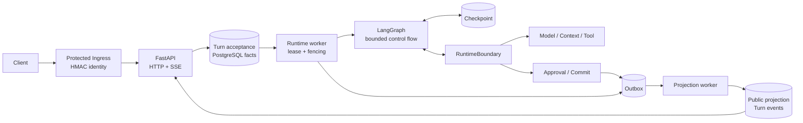

# DocReview Agent AI Agent 面试准备文档

> 面向当前工作树实际代码、测试和 `docs/remediation/` 契约整理；不只依据 README 或提交历史推断。
>
> 证据时间：2026-08-20  
> 项目形态：Python 3.13 + FastAPI + PostgreSQL + LangGraph
> 本次交付：Phase 0，只做范围冻结、契约分析和治理文档；不连接数据库、不执行 migration、不调用真实 Provider/Tika。仓库状态文档记录过 2026-08-19 的受控本地 PostgreSQL/Tika/Provider round-trip，但本次未复跑；staging、容量、故障注入和回滚演练仍无完成证据。

## 先记住一句话

这是一个把模型推理变成**可恢复、可审计、可授权、可重放**的文档审查工作流。

- LangGraph 只做有界编排和 checkpoint/resume。
- PostgreSQL 保存 `Run / Step / Attempt / Tool / Approval / Commit / Outbox / Projection` 等持久化事实。
- HTTP/SSE 只暴露公开 projection，不直接暴露 GraphState、工具原始 payload 或内部 checkpoint。

面试时先讲事实源和不变量，再讲框架名称。不要把“用了 LangGraph”讲成系统设计本身。

## 1. 面试开场版本

### 30 秒版本

DocReview Agent 是一个面向文档审查和修改的持久化 AI Agent 服务。外层用 FastAPI 暴露资源、文件、Assistant Turn、Run、Approval 和 SSE 接口；中间用 PostgreSQL 记录完整工作流事实和事务边界；LangGraph 只承载有限节点、checkpoint 和 interrupt/resume。

典型链路是：上传文档或提交 Turn，创建 `Turn/Run/Step`，Runtime worker 领取 Step，Graph 节点通过 `RuntimeBoundary` 调用模型、Context、Tool 和 Commit 子系统，结果写入 Outbox，再由 Projection worker 生成公开 DTO，HTTP 或 SSE 读取 projection，并支持幂等重试和 `Last-Event-ID` 重放。

### 2 分钟版本

业务目标不是简单地让 LLM 输出一段文字，而是让审查结果可以回到准确的 `Resource/Version/Node/Evidence`，并在高风险修改前经过授权。

文档先经过有界解析、规范化、AST/hash 和 chunk projection；检索侧区分 legacy Resource Search 与 `EvidenceService`，运行时还要固化 `ContextManifest`。Agent graph 先理解目标、组装上下文、决定下一动作，再检索、读取节点、分析证据、生成 Patch。

Patch 必须带 `base_version_id`、每个操作的 `expected_hash` 和 `evidence_refs`。通过 Patch Validation 后创建绑定到 patch fact 的 Approval，外部 owner/admin 决定后才允许 Commit。Commit 在 Serializable 事务中重新检查 scope、版本和节点 hash，并和新版本、派生 projection、Outbox 一起原子提交。

## 2. 业务目标与在线范围

### 业务目标

1. 让用户上传并阅读文档，在准确的资源和版本范围内检索证据。
2. 让 Agent 产生有 provenance 的观察、发现和 Patch，而不是只返回不可验证的自然语言。
3. 让修改动作受审批、资源授权、版本冲突和幂等键约束后再提交。
4. 让长任务在进程重启、SSE 断开、worker 抢占和 provider 重试后继续恢复，而不是依赖进程内状态。
5. 保持当前 HTTP 方法、路径、DTO、错误状态、SSE event name、`X-Request-ID` 和 `Last-Event-ID` 兼容性。

### 实际注册的 API

| 路由族 | 方法与路径 | 关键契约 |
|---|---|---|
| 基础 | `GET /healthz` | 返回 `{status: ok, service: server}`；middleware 回写 `X-Request-ID` |
| 资源 | `GET /api/resources`、`/{id}`、`/{id}/export`、`/{id}/search` | compatibility workspace scope、当前版本、最多 5 条 citation、导出 Markdown |
| Agent Run | `GET /api/agent/runs`、`/{id}` | signed user identity；公开 allowlist DTO，不泄露 raw state/tool payload |
| Approval | `GET /api/agent/approvals`、`/{id}`；`POST /{id}/approve`、`/reject` | owner/admin 决策，状态冲突 `409`，decision 原子恢复 continuation |
| Assistant 能力 | `GET /api/assistant/capabilities` | 上传扩展名由 parser policy 派生 |
| Assistant session | `GET /api/assistant/sessions`、`/{id}`；`DELETE /{id}` | 查询/删除使用 compatibility workspace scope |
| Session 资源选择 | `GET/PUT /api/assistant/sessions/{id}/resource-selection` | trusted ingress；可变 Session 选择不回写已创建的 Turn/Run 快照 |
| Assistant Turn | `POST /api/assistant/conversations`、`/stream`；`POST /sessions/{id}/messages`、`/stream` | trusted ingress、durable acceptance、非流式 projection 或 SSE replay |
| Assistant upload | `POST /api/assistant/conversations/files`、`/sessions/{id}/files` | multipart file，默认 20 MiB，上游 parser 和元数据事务 |
| 文件 | `GET /api/files/{id}/download` | 按 workspace 查元数据，再流式读取原始内容 |

### 范围陷阱

当前应用未注册 `resource task-context`。历史目录中的 `tasks/approvals/execution_jobs`、shadow comparison 和 parity 包，也不能自动算作当前在线闭包。

## 3. 代码结构：从入口读到核心事实

| 目录 | 职责 | 面试时的读法 |
|---|---|---|
| `api/` | FastAPI app factory、middleware、路由、依赖注入、错误映射、生产装配 | 先看 `main.py`，再看 routes 与 `api/assembly.py`，确定真实在线范围 |
| `identity/` | trusted ingress HMAC、`WorkspaceScope`、membership/role/resource policy | 回答租户隔离和为什么不能信任客户端 header |
| `turn/` | Turn DTO、幂等 acceptance、共享 HTTP/SSE pipeline、事件映射 | 回答 request replay、非流式与流式一致性 |
| `runtime/` | Run/Step/Attempt/Tool/Approval/Outbox runtime engine、lease、retry、projection worker | 回答重启恢复、并发 worker、fencing |
| `agent_graph/` | 严格 Pydantic `GraphState`、节点、interrupt/resume、checkpointer、生产边界适配 | 回答 LangGraph 到底负责什么 |
| `tool_runtime/` | 工具 Registry、schema、policy、approval、rate limit、audit、artifact 和 side effect recovery | 回答工具调用安全和幂等 |
| `document/` | 上传解析、canonical AST、稳定 node id/hash、Patch、Commit | 回答证据回溯和修改冲突 |
| `knowledge/` + `context/` | legacy search、`EvidenceService`、结构化 chunk、`ContextManifest` 组装 | 回答 RAG 召回、扩窗和上下文预算 |
| `providers/` | LLM、embedding、reranker、web search、Tika 和生产依赖装配 | 回答 provider 超时、重试、配置 fail-closed |
| `storage/postgres/` | 参数化 SQL、repository、事务、锁、scope predicate、outbox/receipt | 回答数据一致性；不要只看 Python 类名 |
| `operations/` + `deploy/` | reconciliation、重投影、容量告警、nginx trusted ingress | 回答上线、回滚和运维边界 |

### 建议阅读顺序

1. `AGENTS.md`、`docs/remediation/status.md`、`api-contract.md`、`persistence-contract.md`：冻结边界和不变量。
2. `src/docreview/api/main.py`：应用工厂、CORS、request ID、lifespan、router 注册。
3. `src/docreview/api/assembly.py`：生产依赖闭包，确认哪些 repository/provider/worker 真正接上。
4. `src/docreview/turn/coordinator.py`、`pipeline.py`、`sse.py`：理解请求接受、投影等待和 replay。
5. `src/docreview/runtime/engine.py`、`runtime_repository.py`、`runtime/projection.py`：理解 worker 与事务。
6. `src/docreview/agent_graph/models.py`、`graph.py`、`runtime.py`：理解 `GraphState`、节点和边界。
7. `src/docreview/agent_graph/production.py`、`tool_runtime/runtime.py`：理解真实副作用如何被 policy/audit 包住。
8. `src/docreview/document/commit.py`、`storage/postgres/document_commit.py`、`knowledge/evidence_service.py`：理解证据到提交。
9. `tests/`：用失败路径和 SQL contract 验证上述叙述，而不是只用 README 猜。

## 4. 技术架构与依赖装配

### 分层架构

| 层 | 核心组件 | 边界原则 |
|---|---|---|
| HTTP/兼容层 | FastAPI routes、APIError、request ID、CORS | 保持公开 method/path/DTO/status；只把公开 projection 转成响应 |
| 身份与授权 | `TrustedIngressAdapter`、`PolicyResolver`、`IdentityRepository` | HMAC attestation 证明 principal/workspace；membership 和 resource ownership 再授权 |
| 持久化事实层 | `TurnRepository`、`RuntimeRepository`、`CommitStore`、`UploadMetadataRepository` | PostgreSQL 事务、锁、unique key 和 scope predicate 是事实源 |
| 编排层 | LangGraph `StateGraph`、checkpoint、interrupt/resume | 只做有界控制流；通过 `RuntimeRequest/Response` 调用权威子系统 |
| 能力层 | `ModelGateway`、Evidence/Context、`ToolRuntime`、Committer | 每类副作用都有 typed contract、policy、audit 或事务边界 |
| 异步 worker | `RuntimeWorker`、`ProjectionWorker` | claim + lease + generation fencing；Outbox publication 与事实写入解耦 |
| 可观察性 | JSON logging、capacity alerts、reconciliation | 记录安全 metadata，不写正文、凭据或 provider body |

### 一张图讲清系统



图中只有 PostgreSQL facts、checkpoint、Outbox 和 public projection 可跨进程恢复。HTTP 连接、SSE observer、Graph 节点调用栈都不是事实源。

### 生产装配闭包

生产 lifespan 的顺序很重要：

1. 加载 provider dependencies。
2. 打开 PostgreSQL pool。
3. 调用 `assemble_production_repositories`。
4. 创建 Resource/Run/Assistant/Identity/Turn/Runtime/Projection/Upload repository。
5. 构建 canonical committer、legacy search、`DocumentUploadService`、`TurnCoordinator + DurableRunner`。
6. 如果启用 runtime worker，继续创建 `ProjectRuntimeBoundary`、LangGraph executor/checkpointer、`RuntimeEngine`、`RuntimeWorker` 和 `ProjectionWorker`。

任一关键 provider、tokenizer、trusted ingress、worker id 或 database pool 缺失，production 都应 fail closed。

| 依赖 | 来源 | 缺失时的行为 |
|---|---|---|
| Model/Embedding/Reranker/Tika/FileStore | `providers/assembly.py` + Settings | production lifespan 拒绝启动；开发模式可保持空依赖 |
| Trusted ingress | `Settings.trusted_ingress` + `TrustedIngressAdapter` | production repository assembly 抛错；持久化路由无签名返回 `401` |
| DatabasePool | `create_database_pool(settings)` | 未打开或 `DATABASE_URL` 缺失时不组装 production SQL repository |
| Runtime worker | `RUNTIME_WORKER_ENABLED`、`RUNTIME_WORKER_ID` | 未启用时可仅提供 HTTP/acceptance 依赖；启用但闭包不全则 fail closed |
| Projection worker | `build_production_durable_runtime` | 与 `RuntimeLifecycle` 一起启动；负责公开 outcome projection |

## 5. 核心数据流：面试必须能画出来

### 5.1 文档上传流

1. Ingress 校验 trusted identity、workspace 和 multipart file；文件大小和扩展名在调用 writer 前检查。
2. `DocumentUploadService` 先把 bytes 写入同目录不可见 staging，再调用 parser/ingestion 生成 canonical AST、node/hash 和结构化 chunk projection 输入。
3. `UploadMetadataRepository` 在一个事务中按 `session -> resource/version -> canonical section/chunk projection -> uploaded_file -> assistant_message -> session selection/timestamp` 写入。
4. commit 前回调执行 content-addressed `promote`；发布失败则数据库整体 rollback。若对象是本次新建，后续失败会补偿删除；若命中既有相同内容，不会误删共享对象。
5. embedding provider I/O 不进入上传事务；chunk 先以 profile-bound pending facts 落库，再由事务外 projection 路径处理。

**常见追问：为什么先 stage 文件、最后 promote？**  
答案：让数据库 commit 前就能证明文件发布成功，避免出现 metadata 已提交但 blob 缺失的半个事实图。

### 5.2 Assistant Turn 非流式流

1. HTTP middleware 选择或生成 `X-Request-ID`，并在响应中回写；持久化请求需要该准确值参与 HMAC canonical tuple 和 idempotency。
2. 路由解析 message/resource_id，使用 `TrustedIngressAdapter` 验证 principal、organization、workspace、roles、issued_at 和 signature。
3. `DurableRunner` 调 `TurnCoordinator.submit`；coordinator 规范化 UUID、runtime_mode、principal scope，生成 canonical input JSON/hash。
4. `TurnRepository` 在一个 acceptance 事务中查或创建 session、user message、Turn、Run、初始 `UnderstandGoal` Step、有序事件和 Outbox。
5. runner 轮询公开 projection；只有事件已有确定 terminal/waiting status 且 projection sequence 已追平，才返回 DTO。超时返回 `503`，客户端用相同 request id 重试。

**关键思想：** HTTP 线程不是 Agent 生命周期。请求结束只代表 acceptance 或读取 projection，Run/Step/worker 仍可在进程外继续。

### 5.3 SSE 与 `Last-Event-ID` replay

SSE 与非流式共用同一个 `DurableRunner`。stream 路由在启动前完成 body、cursor 和 identity validation；启动后 observer 把 `TurnEvent` 映射成冻结的 event name：

- `turn_state`
- `message_completed`
- `error`
- `done`

持久化 sequence 直接作为 SSE id，重连时只 replay `Last-Event-ID` 之后的事件。传输取消只取消 observer，不取消持久化 pipeline task；客户端用同一 `request_id` 重连。

| 状态/事实 | 公开 SSE frame |
|---|---|
| `turn.accepted` / `turn.running` / `run.queued` | `turn_state` |
| `assistant.message` | `message_completed` |
| `turn.waiting_input` / `turn.waiting_approval` | `turn_state` + `done` |
| `turn.succeeded` | `done` |
| `turn.failed` / `turn.cancelled` | `error` + `done` |
| 内部异常或 persisted terminal 无结果 | 非负 reconnect cursor 的 `error`，随后关闭 |

### 5.4 Runtime worker 与 Graph 流

1. `RuntimeEngine.recover` 先回收过期 lease，再 `process_one`；Repository 用 `FOR UPDATE SKIP LOCKED` claim 一个可运行 Step，并递增 `lease_generation`。
2. 每次执行带 owner、lease expiry、generation 的 `WorkItem`；heartbeat、retry、completion 都带同样的 fencing predicate。
3. `LangGraphExecutor` 以 `run_id + step namespace` 建立 checkpoint。Graph node 本身不访问 provider/repository，而是 interrupt 发出 `RuntimeRequest`。
4. `RuntimeBoundary` 将 request 分派到 ModelGateway、ContextAssembler、ToolRuntime、Committer 或 Runtime；返回严格 `RuntimeResponse` 后 resume checkpoint。
5. 遇到 `await_user_input` / `await_approval`，GraphExecutor 返回 `WAIT_INPUT` / `WAIT_APPROVAL`，并把 graph_request、checkpoint thread/step、graph_state 持久化到 Step output；外部事实到位后 continuation resume。
6. 完成或失败时，`RuntimeRepository` 在事务中写 Attempt terminal telemetry、Step/Run outcome、next steps 和 Outbox。

### 5.5 Agent graph 节点序列

| 节点 | 输入/输出事实 | 失败或停止条件 |
|---|---|---|
| `UnderstandGoal` | request fact -> Goal + `context_manifest_id` | 严格 schema；模型不能覆盖 scope |
| `AssembleContext` | Context candidates -> immutable `ContextManifest` | token budget/reserved output 约束 |
| `DecideNextAction` | Goal/context/observations/budget -> typed Action | cycle、no-progress、budget exhaustion |
| `RetrieveEvidence` / `ReadDocumentNodes` | ToolRuntime observation -> persisted Observation | policy、resource ownership、rate limit、tool error |
| `AnalyzeEvidence` | observations -> FindingRef + observation | finding 必须绑定 evidence ids |
| `GeneratePatch` | finding refs -> PatchRef | base version、operation shape、patch hash |
| `ValidatePatch` | PatchRef -> valid PatchRef | AST/schema/hash/source authorization |
| `RequestApproval` | valid patch -> pending ApprovalRef | 审批 request 只能创建 pending fact |
| `AwaitApproval` | pending approval + checkpoint -> approved/rejected | 决定必须匹配 approval/patch fact |
| `CommitPatch` | approved patch -> CommitRef + Outbox | Serializable recheck；失败即 conflict |
| `RenderOutcome` | facts -> OutcomeRef / public message | 只输出 bounded projection |

### 5.6 高风险修改的完整闭环

高风险工具在 `ToolDefinition` 中必须 `requires_approval=True`。`RuntimeToolExecutor` 的顺序是：

```text
strict JSON/schema validation
  -> scope/resource binding
  -> Policy
  -> approval binding
  -> rate limit
  -> audit claim
  -> backend execute/recover
  -> output schema/size/artifact
  -> audit finish
```

Graph 不能绕过 `ToolRuntime` 直接写数据库。Approval fact 绑定 workspace、run、step、tool/version、input hash、patch hash、resource refs 和 target idempotency key；owner/admin 决策后，approval repository 原子地创建唯一 `CommitPatch` continuation 或 rejected terminal outcome。

## 6. 一致性、安全和可恢复性不变量

| 不变量 | 实现证据 | 面试答法 |
|---|---|---|
| 幂等 | Turn/Run/Step/Tool/Approval/Commit/Outbox/Projection receipt unique keys + canonical hash | 相同 key 相同 input 返回既有事实；不同 canonical body 必须 conflict |
| 隔离 | SQL 每条 query/write 都绑定 workspace/resource/version；Policy 再查 membership/ownership | 不能先跨租户查再内存过滤  |
| fencing | `owner + lease_expires_at + lease_generation` 条件 | 旧 worker 即使恢复也不能覆盖新 claimant |
| 事务 | acceptance/outcome/approval/commit/upload 各自闭包 | Outbox 是事务交接点，provider I/O 在事务外 |
| 公开面 | Run DTO allowlist、Projection reader、SSE mapper | 不能暴露 raw state、manifest、tool payload、凭据或内部 trace |
| 可恢复 | checkpoint + graph_resume + persisted events + projection receipts | 重启/断线后重读事实，不依赖内存 channel |
| 预算 | max_steps、max_tool_calls、token/cost/deadline + cycle/no-progress | 模型不能无限循环，也不能无限放大上下文 |
| 审计 | Attempt、Tool audit、Observation、Approval、Commit、Outbox | 每个副作用有可解释的 provenance 和状态迁移 |

### Trusted ingress 的签名 tuple

HMAC-SHA256 canonical input 按换行连接以下字段：

```text
v1
request_id
HTTP_METHOD
request_path
principal_type
principal_id
organization_id
workspace_id
issued_at_rfc3339nano
comma_separated_roles
```

Adapter 检查 UUID、principal type、时间窗口、低写十六进制 signature、常量时间比较和请求 workspace 一致性。Ingress 必须先剥离客户端伪造 header，再生成 attestation；Python 适配器不是 IdP。

## 7. 文档审查与 RAG 设计

### 当前代码已经实现的链路

```text
Upload bytes
  -> bounded text / Tika XHTML parser
  -> ParsedElement (heading/clause/list/table/page/source span)
  -> hierarchical canonical AST + stable node/hash
  -> deterministic section / parent-window / child projection
  -> pending embedding facts
  -> lexical + semantic recall
  -> weighted-sum 或 RRF fusion
  -> child rerank
  -> parent-window sibling expansion
  -> immutable ContextManifest
  -> Finding / Patch / Approval / Commit
```

- Production 强制 `DOCUMENT_PARSER=structured`。Markdown/TXT 由规则解析；DOC/DOCX/PDF/RTF/ODT 通过有界 Tika XHTML 解析，保留 heading、list、table 和可用的 page mapping。
- Canonical model 保存 `NodeType`、`source_location`、`page_mapping`、`metadata`、`content_hash`；稳定 node ID/hash 让 citation、evidence 和 Patch 回到准确节点。
- `REVIEW_STRUCTURE_PROFILE` 是唯一生产切块 profile：child 目标/硬上限为 384/512 tokens，parent window 目标/硬上限为 960/1440 tokens；只在同一 atom 的强制拆分中使用 overlap。
- child 的原文用于 citation，heading path、role 和 overlap 只进入确定性 `embedding_text`；metadata 保存 fragment hash、embedding-text hash、tokenizer profile、source spans、window/order 和 quality flags。
- Resource Search 仍走兼容的 `LegacySearchService`，最多输出五条 citation；Agent ToolRuntime 使用 `EvidenceService`，支持 lexical/semantic 两路、weighted sum 或 RRF、rerank、显式 degradation provenance 和 profile mismatch fail-closed。
- `PostgresContextCandidateSource` 只在 child fusion/rerank 后按 `window_group_id` 查询有序 siblings；每个 sibling 保留独立 node/hash/source spans，不能借扩窗扩大 Patch 授权。
- `ContextManifest` 保存精确的有序 items、tokenizer、budget、reserved output、total tokens 和 content hash。Graph replay 按 manifest ID 重载，不能用“当前检索结果”重建历史上下文。
- Canonical Commit 在 Serializable 事务内重检 base version、expected node hash、evidence 和 scope，原子写新 version、canonical nodes/source mappings、section/chunk projection、commit fact 与 Outbox。

### 仍要如实说明的边界

- `docs/remediation/document-review-chunking-spec.md` 标题仍保留“待批准实施”的历史冻结状态，但当前工作树代码、测试和 `status.md` 已显示该方案落地。面试以装配代码和测试为当前证据，同时说明该文档是审计基线而非最新状态页。
- 生产装配使用版本化的本地 `DeterministicTokenizer`。它对本地算法是确定且可哈希的，但不是从 Provider 拉取的官方模型词表；真实模型 token parity 和 profile 管理仍是上线风险。
- 本轮没有复跑数据库、Tika 或真实 Provider。仓库记录的是 2026-08-19 的本地 round-trip，不等价于 staging 容量、故障注入或正式生产验证。
- 历史重投影入口是显式 scope、dry-run-first 的 operator API，没有自动 scheduler；结构缺失时要求 source-backed re-ingestion 并创建新版本，不能偷偷改写历史 canonical facts。

| 阶段 | 权威事实 | 不能做的事 |
|---|---|---|
| 解析 | bounded `ParsedElement` / AST | 不能让 LLM 推断标题或结构事实 |
| 规范化 | stable node ID/hash + source/page mapping | 不能改变既有 hash 与 Patch 语义 |
| 投影 | section + child + parent window + profile | 不能在 HTTP read 中 lazy backfill |
| 召回 | scoped lexical/semantic child candidates | 不能跨 workspace/resource/version/profile 召回后再内存过滤 |
| 扩窗 | ordered sibling -> 独立 `ContextItem` | 不能把 sibling 伪装成命中证据或扩大写授权 |
| 重放 | persisted `ContextManifest` | 不能重新检索并声称是原始模型上下文 |

## 8. 面试官最可能问什么

### P0：一定会问的架构题

#### 1. 请你从一个 Assistant Turn 讲完整请求链路

**答题主线：** 从 request ID/trusted ingress 开始，讲 acceptance 事务、Run/Step、worker claim、Graph interrupt、Tool/Context/Commit、Outbox、Projection、HTTP/SSE；明确 HTTP 线程不拥有执行生命周期。

**最可能追问：** SSE 断了怎么办？同 request id 重试怎么办？

#### 2. 为什么已经有 LangGraph，还要 Run/Step/Attempt/Tool 这些表？

**答题主线：** Graph state/checkpoint 是可重建编排状态，不能替代跨进程事实、审计、授权、lease 和公开 projection；数据库事实支持重启、并发和对账。

**最可能追问：** checkpoint 丢了能否恢复？哪些状态能重新计算？

#### 3. 如何防止两个 worker 同时执行同一个 Step？

**答题主线：** `FOR UPDATE SKIP LOCKED` claim + owner + expiry + generation；heartbeat/completion/retry 都重复 predicate；旧 claimant 更新影响行数为 0 即 `LeaseLost`。

**最可能追问：** 为什么只靠 asyncio lock 不够？

#### 4. 如何保证重试不产生重复副作用？

**答题主线：** 稳定 idempotency key、canonical input hash、audit claim/recovery receipt；side-effecting tool 没有 backend receipt 时 fail closed，不盲目重放。

**最可能追问：** 相同 key 但 input 改了怎么办？

#### 5. 为什么 Outbox 必须和事实写在同一事务？

**答题主线：** Outbox 是事实到异步投影/发布的原子交接；同事务保证不出现事实已提交但没有事件，或事件先于事实。发布本身可重试，receipt 保证幂等。

**最可能追问：** 为什么不直接在 commit 事务里调用 provider/webhook？

#### 6. workspace/resource/principal 隔离在哪里做？

**答题主线：** Ingress 证明 scope，handler 绑定 scope，Policy 查 membership/ownership，SQL 每个边界再次带 workspace/resource/version predicate，Commit 再 Serializable recheck。

**最可能追问：** 能否先查全量再 Python 过滤？

#### 7. 审批如何避免只在内存里挂起？

**答题主线：** Approval 是持久事实，绑定 patch/input/resource/hash；Graph checkpoint 记录 await request；决策事务原子创建 continuation 或 rejection outcome，再由 worker resume。

**最可能追问：** 批准后如何证明批准的是原来那份 patch？

#### 8. Commit 为什么还要重新校验 hash 和版本？

**答题主线：** 模型生成和审批之间文档可能变化；Serializable lock/recheck 防止 stale base version、node hash、scope 或 evidence 被绕过。

**最可能追问：** 如果 base version 冲突返回什么？

#### 9. 这个系统能保证 exactly-once 吗？

**答题主线：** 不承诺端到端 exactly-once。Step、Outbox 和网络调用都可能 at-least-once；系统用稳定幂等 key、canonical hash、唯一约束、fencing 和 receipt 把“重复调度”收敛为“事实只提交一次”。对超时后结果未知的副作用，backend 必须能按 receipt `recover`；若不能确认，side-effecting tool fail closed，不能盲目重放。

**最可能追问：** provider 已执行成功但响应丢了怎么办？

#### 10. 为什么选 LangGraph，不直接用 Celery/队列？

**答题主线：** LangGraph 适合表达动态决策、条件边和 interrupt/resume；队列/worker 适合可靠调度。项目实际上把两类职责分开：LangGraph 只表达节点控制流，PostgreSQL Runtime 负责 claim、lease、retry、审批和事实。换成别的编排框架也不能删掉持久化层。

**最可能追问：** 如果去掉 LangGraph，哪些模块仍然成立？

#### 11. 如何防 prompt injection？

**答题主线：** 文档、网页、历史消息和 evidence 全标为 untrusted；模型只能产生严格 typed action，不能提供 workspace、权限或直接数据库命令。ToolRuntime 的 schema、scope、Policy、Approval、rate limit 和 Commit recheck 都在模型外执行，因此 prompt injection 最多影响建议，不能自动扩大权限。

**最可能追问：** 如果模型把文档中的恶意文本当成系统指令呢？

#### 12. 当前最明显的扩展瓶颈是什么？

**答题主线：** PostgreSQL 同时承担事实、队列、Outbox、projection 和 scoped retrieval，热点可能在 queued Step claim、Outbox lag、连接池、SSE 长连接、embedding/rerank 和同 Session/Resource 锁。当前通过有界 batch、`SKIP LOCKED`、短事务、provider I/O 事务外、容量告警控制；多副本与故障注入尚需 staging 证据。

**最可能追问：** 为什么当前只允许一个 Uvicorn worker？

### P1：深入实现题

| 问题 | 答题主线 |
|---|---|
| `DurableRunner` 为什么要等 projection 追平事件 sequence？ | 避免返回一个 events 已 terminal 但 public DTO 还没写好的半成品；`deterministic status + projection.status + last_event_sequence` 三者同时满足才返回。 |
| `Last-Event-ID` 重放为什么不能只靠内存队列？ | 内存队列会随进程消失，持久化 TurnEvent sequence 才能跨重启重放；SSE id 直接使用事实 sequence。 |
| Graph node 如何限制死循环？ | `max_cycles`、`max_no_progress`、`max_observations`，加上 Runtime 的 `max_steps`、`max_tool_calls`、token/cost/deadline。重复 observation hash 增加 no-progress。 |
| ToolRuntime 的安全执行顺序是什么？ | `schema -> scope/resource -> policy -> approval -> rate limit -> audit claim -> backend/recovery -> output schema/size/artifact -> audit finish`。前置失败不得产生后续副作用。 |
| 大工具输出为什么要 artifactize？ | inline output 有字节和 token 上限；大内容写 content-addressed artifact，只在公开观察中返回 bounded summary 和 provenance。 |
| 为什么公开 Run DTO 不暴露 GraphState？ | GraphState 含内部 fact ids、manifest、tool input/output、checkpoint 和控制状态；公开 projection 只给用户需要的 allowlist。 |
| 上传事务为什么锁 session，且 message sequence 用数据库生成？ | 串行化 session 内消息顺序，避免并发写产生相同 sequence；同一事务让 session、resource、file、message 一起成功或回滚。 |
| Session 当前选择和 Run resource scope 有什么区别？ | Session selection 是可变客户端状态；每次 Turn body 的 `resource_id` 才会快照到 Turn/Run。后续切换不能改变旧 Run、Approval 或 Commit 的授权对象。 |
| 当前 API 认证覆盖是否完全对称？ | 不是。Run/Approval、持久化 Turn 和 upload 校验 trusted ingress；health、resources、capabilities、session query/delete、file download 走 compatibility scope 或无 identity adapter，这是冻结兼容缺口。 |
| 配置如何避免开发模式误判生产可用？ | development 可启动但 `AppDependencies` 为空；production lifespan 检查 provider、pool、trusted ingress、worker、tokenizer 并 fail closed。 |
| 为什么当前强制一个 Uvicorn worker？ | Runtime/Projection lifecycle 与 Web 进程同生命周期，当前配置只验证单进程所有权。多 worker 会各自启动 pool 和后台 worker；数据库 fencing 能保护单条事实，但整体容量、关闭和多副本行为尚未形成准入证据，因此 settings 直接拒绝。 |
| Provider 调用如何重试？ | Provider 层只重试声明为 retryable 的 429、部分 5xx、timeout，使用有界 backoff；取消向上传播，永久错误和超大/畸形响应不重试。Runtime 再按错误类别、attempt/step/run deadline 决定是否重排 Step。 |
| 数据库 round-trip 测试为何可能没有跑？ | 只有 `ALLOW_DB_TESTS=1`、`TEST_DATABASE_URL`、`_test` 数据库名和 host allowlist 全满足才连接；否则必须 skip，不能读生产 `DATABASE_URL`。 |

### P2：针对当前代码缺口和兼容性的追问

| 问题 | 答题主线 |
|---|---|
| 为什么缺 `resource_id` 的 durable Turn 不是 `400`？ | Handler DTO 允许可选，但当前 durable repository/prepare 要求非空 scope；冻结行为会落到通用 `500`，这是兼容性缺口，不能在未批准的修复中擅自改成 `400`。 |
| 相同 request id 不同 body 为什么不是 `409`？ | 内部有 `IdempotencyConflictError`，但当前 Assistant adapter 的冻结映射仍是通用 `500` 或已启动 SSE 后的 error event；改变公开状态属于单独 API 修复。 |
| `document-review-chunking-spec.md` 还写待批准，为什么代码已有父子切块？ | 该文件保留初始治理门禁，当前状态页、装配代码与测试是更新证据。可以说当前工作树已实现并有离线/本地验证，但不能把历史规格标题改口成 staging/生产验证。 |
| 仓库没有 migrations，如何证明 SQL 合法？ | 以批准的 schema artifact 和现有 SQL contract tests 为依据；Phase 0 不根据 Python SQL 臆造 migration，也不连接数据库。 |
| 为什么一些 read route 没有 trusted ingress？ | 当前兼容性边界认证不对称；只能如实指出风险和后续修复，不把 Runtime scope 的存在当作所有路由已隔离。 |
| 生产是否真的提供了 web search / Tika / file store？ | 依赖由 providers assembly 和 settings 装配；状态页记录了本地受控 round-trip，但 Web Search 可选，本轮未复跑，且没有 staging/容量/故障注入证据，不能说生产已验收。 |
| 本地 tokenizer 能代表模型真实 token 数吗？ | 当前 tokenizer 是版本化、可哈希、确定性的本地算法，能保证本项目预算和重放一致；它不是 Provider 官方词表，因此模型 token parity 仍需专项校准或接入批准的 tokenizer artifact。 |

## 9. 面试官从哪里开始追问

| 起点 | 第一层追问 | 第二层追问 | 第三层追问 |
|---|---|---|---|
| Assistant Turn | 如何接受请求？ | 如何幂等和重放？ | projection lag / timeout / SSE cancel 怎么处理？ |
| LangGraph | 有哪些节点？ | interrupt/resume 如何实现？ | 为什么 checkpoint 不是事实源？ |
| Tool call | 工具如何注册？ | policy/approval/rate limit 顺序？ | side effect timeout 后如何恢复而不重放？ |
| Document patch | Patch 如何表达？ | `expected_hash/base_version_id` 如何校验？ | 审批后文档变化如何避免 stale commit？ |
| PostgreSQL | 哪些表保存 Run？ | 事务边界是什么？ | `SKIP LOCKED + generation` 如何 fencing？ |
| RAG | 如何搜证据？ | lexical/semantic/rerank 如何融合？ | 父窗口扩展是否扩大授权？ |
| 安全 | 谁给 workspace？ | HMAC 如何防伪造？ | 为什么部分兼容路由仍无 trusted identity？ |
| 上线 | 如何启动？ | 怎么观察 queue/lease/outbox lag？ | 回滚如何保留已接受事实并继续恢复？ |

### 答题顺序

先说状态/事实，再说事务/锁，再说失败恢复，最后说 API 映射。面试官通常会从“功能怎么跑”追到“并发和失败时谁是事实源”。

### 最常见的深挖路线

```text
“请介绍项目”
  -> 为什么需要持久化 Agent？
  -> LangGraph 和 PostgreSQL 谁是事实源？
  -> 一个 Step 如何被领取？
  -> worker 在副作用后崩溃怎么办？
  -> 如何幂等、fencing 和 recover？
  -> Outbox 与 Projection 为什么分开？
  -> SSE 如何证明没有漏消息？
```

```text
“你们的 RAG 怎么做？”
  -> 文档结构从哪里来？
  -> 为什么 child recall + parent context？
  -> lexical/semantic 如何降级？
  -> citation 如何回到 source span？
  -> 扩窗会不会扩大 Patch 权限？
  -> replay 为什么不能重新检索？
```

```text
“Agent 能改文档吗？”
  -> Patch 如何绑定 base version/node hash/evidence？
  -> 谁能审批？审批绑定哪些事实？
  -> 批准后文档变化怎么办？
  -> Commit 失败是否会留下半个版本？
  -> 相同 commit key 不同 patch 怎么处理？
```

每条路线都应主动落到一个失败场景。只讲 happy path，面试官下一句通常就是“进程在这里挂了怎么办”。

## 10. 代码题/系统设计题回答模板

### 模板 A：设计一个可恢复的 Agent worker

1. 定义事实：Run、Step、Attempt、Tool、Approval、Outbox、Projection。
2. 定义状态机和合法迁移；把 terminal/waiting 状态写入数据库。
3. 用事务 + `SKIP LOCKED` claim；给 worker owner、expiry、generation。
4. 每次 heartbeat/retry/complete 都带 fencing predicate。
5. 副作用使用业务幂等 key 和 input hash；side effect receipt 不确定时 fail closed。
6. Outbox 与事实同事务；Projection 以 event receipt 幂等。
7. 重启先 recover lease，再领取新任务；监控 queue age、lease、retry、dead letter。

### 模板 B：排查“用户收到 200 但没有结果”

1. 检查 `X-Request-ID`、Turn 是否 acceptance 成功，input hash 是否冲突。
2. 检查 TurnEvent 是否已有 deterministic terminal/waiting 状态。
3. 检查 Run/Step 是否被 worker claim，lease 是否过期，Attempt 是否 terminal。
4. 检查 Outbox 是否 `pending/publishing/dead_letter`，projection receipt 是否存在。
5. 检查 public projection status/`last_event_sequence` 是否追平。
6. 确认不要用同一个请求创建第二个 Turn；用同 request id 重试或 SSE `Last-Event-ID` replay。

### 模板 C：解释一次 Patch 不应提交的原因

先区分：`schema invalid`、`policy denied`、`approval rejected`、`idempotency conflict`、`base version conflict`、`expected node hash mismatch`、`scope mismatch`、`lease lost`。

每一类都应在正确的事实层记录 error category 和审计，而不是把所有错误转成模型自然语言。Commit 事务必须 rollback，不应写半个新版本或孤立 Outbox。

## 11. 当前已知缺口：面试时如何诚实表达

| 事实 | 不要夸大的说法 | 推荐说法 |
|---|---|---|
| 验证范围 | 已经做完全链路生产验证 | 状态页记录 2026-08-19 本地 PostgreSQL/Tika/Provider round-trip；本轮未复跑，staging、容量、故障注入和回滚仍待证据 |
| 数据库 | 仓库自带完整 migrations | 仓库只含追加的 `025`，缺少 001-024/Alembic；新环境必须使用批准的基础 schema artifact |
| 结构化切块 | 父子 window 已在正式生产充分验证 | 当前工作树已有 structured parser、token-aware child、parent window、扩窗和测试；生产 tokenizer parity 与 staging 质量仍要验证 |
| 认证 | 所有 API 都有统一租户认证 | 持久化 Agent/Turn/upload 有 trusted ingress；部分兼容读路由仍是非对称边界 |
| Session 选择 | 切换文档会自动重定向当前 Agent | 选择只保存客户端当前值；每个 Turn 必须显式传 resource，Run 保存不可变快照 |
| 外部依赖 | provider/Tika 已在生产通过 | 装配和 fail-closed 条件已定义且有本地记录，但当前没有 staging/生产验收 artifact；Web Search 还是可选能力 |
| 多进程 | 数据库有 fencing，所以可任意横向扩容 | SQL 支持并发 claim/fencing，但应用当前强制一个 Uvicorn worker；多副本生命周期与容量尚未完成准入 |
| 测试 | 所有测试都访问真实数据库 | 默认数据库 fuse 阻止连接；SQL 形态、失败路径和静态装配可无数据库验证 |

## 12. 证据索引：被追问时打开哪些文件

| 主题 | 首选文件 | 可证明的结论 |
|---|---|---|
| 在线路由 | `src/docreview/api/main.py`；`src/docreview/api/routes/*` | 注册的 API、middleware、错误和路由边界 |
| 生产装配 | `src/docreview/api/assembly.py`；`providers/assembly.py`；`runtime/assembly.py` | 依赖闭包、fail-closed、worker lifecycle |
| Turn/SSE | `src/docreview/turn/coordinator.py`；`pipeline.py`；`sse.py` | canonical input/hash、projection wait、event mapping/replay |
| Runtime | `src/docreview/runtime/engine.py`；`runtime_repository.py`；`runtime_sql.py` | claim、heartbeat、retry、outcome、outbox SQL |
| Graph | `src/docreview/agent_graph/models.py`；`graph.py`；`runtime.py` | strict schema、节点、interrupt、checkpoint namespace |
| Tool | `src/docreview/tool_runtime/runtime.py`；`models.py`；`registry.py` | schema/policy/approval/rate-limit/audit/artifact 顺序 |
| 身份 | `src/docreview/identity/trusted_ingress.py`；`policy.py` | HMAC tuple、时间窗、membership/resource policy |
| 文档/提交 | `src/docreview/document/model.py`；`commit.py`；`storage/postgres/document_commit.py` | AST/hash、Patch 校验、Serializable commit、Outbox |
| 结构化 RAG | `document/parser.py`；`knowledge/chunking.py`；`knowledge/evidence_service.py`；`storage/postgres/context.py` | XHTML/AST、token-aware child/parent、fusion/rerank、扩窗 provenance |
| 上传 | `src/docreview/document/upload.py`；`storage/postgres/upload_write.py` | stage/promote 和 session/resource/file/message 事务顺序 |
| Session 选择 | `api/routes/assistant_sessions.py`；`storage/postgres/assistant.py`；`migrations/025_assistant_session_resource_selection.sql` | 可变选择、Workspace FK、显式 Run resource 快照 |
| 契约 | `docs/remediation/api-contract.md`；`persistence-contract.md` | 冻结 HTTP、SSE、事务、幂等、scope、lease 语义 |
| 验证 | `tests/api`；`tests/storage`；`tests/runtime`；`tests/agent_graph`；`tests/tool_runtime` | 失败路径、SQL contract、公开 DTO 和 graph/tool 边界 |

## 13. 一页速记

- **业务：** 文档 -> 证据 -> 发现 -> Patch -> 审批 -> Commit；结果必须可回溯、可授权、可恢复。
- **架构：** FastAPI 是兼容边界；PostgreSQL 是事实源；LangGraph 是有界控制流；Outbox/Projection 是公开结果桥。
- **并发：** `SKIP LOCKED` claim + owner/expiry/generation fencing；旧 worker 永远不能覆盖新 claimant。
- **幂等：** canonical JSON/hash + stable key；同 key 同 body replay，不同 body conflict。
- **安全：** trusted ingress 证明 principal/workspace，Policy 查 membership/ownership，SQL 每个边界再次 scope。
- **SSE：** 事实 sequence 就是 SSE id；`Last-Event-ID` 只 replay 后续事件；断线不取消持久化执行。
- **RAG：** structured AST -> token-aware child recall -> fusion/rerank -> parent expansion -> immutable manifest；扩窗不扩大 Patch 权限。
- **诚实边界：** 有本地 round-trip 历史记录但本轮未复跑；staging/容量/故障注入未完成；认证覆盖和多进程部署仍有明确边界。

## 附录：面试前自测清单

- [ ] 不看代码，能在白板上画 `Turn -> Run -> Step -> Attempt -> Tool/Approval -> Commit -> Outbox -> Projection`。
- [ ] 能说清为什么 GraphState、SSE queue、UI state 都不是事实源。
- [ ] 能说出同 request id 相同/不同 body 的行为，以及当前 API 的兼容性例外。
- [ ] 能解释 `lease_generation` 如何阻止旧 worker 写入，以及 recover 在启动时做什么。
- [ ] 能按顺序讲 ToolRuntime 的 schema、scope、policy、approval、rate limit、audit 和 artifact。
- [ ] 能说明 Patch 的 `base_version_id`、`expected_hash`、`evidence_refs` 和审批绑定。
- [ ] 能区分 Resource Search 的 legacy 兼容路径、Agent 的 EvidenceService，以及已实现 parent-window expansion。
- [ ] 能解释为什么系统追求 effectively-once fact commit，而不是宣称端到端 exactly-once。
- [ ] 能解释 Session selection 为什么不能成为既有 Run 的动态授权来源。
- [ ] 能说出至少三条当前缺口，并给出不夸大的验证边界。
- [ ] 能从 `tests/storage` 中指出一条 SQL contract，而不是只说“有测试”。
- [ ] 能回答回滚不会删除已接受事实，而是切入口、排空 worker、继续使用同一 PostgreSQL facts。
